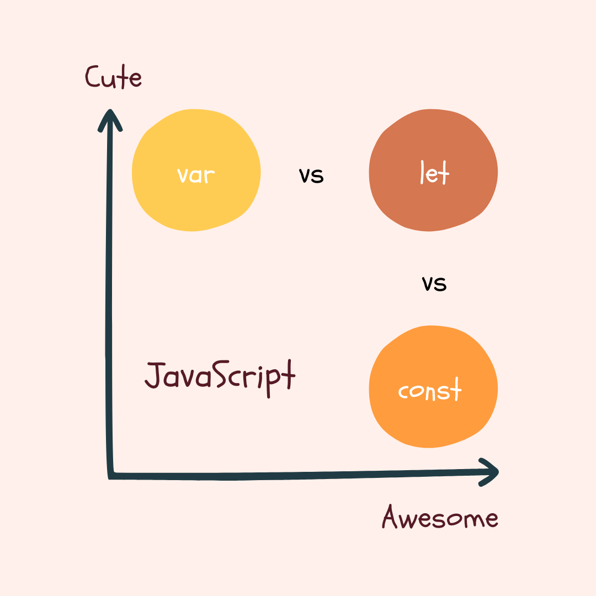

# Hi there , I'm tushar 

## aspiring Web Developer 🐥

I am a learner and tech enthusiasts, figuring out how am i able to watch friends on netflix! 

### me :
- 🧑 I'm 17
- 🌱 I’m currently learning expressjs
- 👯 I’m looking to collaborate on web projects
- 🤔 I’m looking for some project ideas
- 💬 I write blogs
- 😄 Pronouns: he/him
- ⚡ I like to write, be funny and sitcom
- 👀 tushar8104@gamil.com

### Skills

     

 
 ### Blogs
 
 

 

